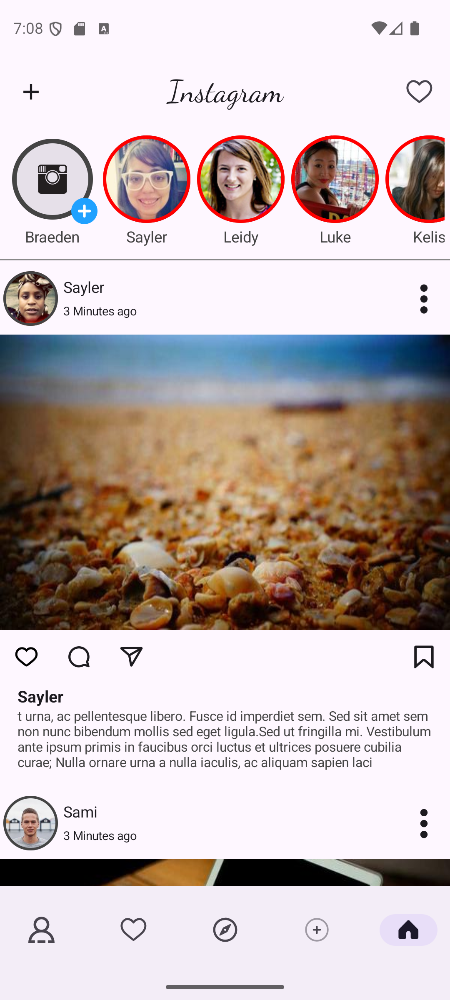

# Instagram Clone - Test Project

یک نمونه پروژه تستی شبیه‌سازی رابط کاربری اینستاگرام با استفاده از Jetpack Compose

## 📱 اسکرین‌شات‌ها



## 🚀 ویژگی‌ها

- طراحی UI شبیه اینستاگرام
- استفاده از Jetpack Compose
- نمایش استوری‌ها با بوردر دایره‌ای
- طراحی Material Design

## 🛠️ تکنولوژی‌های استفاده شده

- Kotlin
- Jetpack Compose
- Material Design 3
- coli

## 📦 نصب و اجرا

1. پروژه را کلون کنید:
```bash
git clone https://github.com/hosseinmasoumi/SocialMedia.git
```

2. پروژه را در Android Studio باز کنید

3. پروژه را Build و Run کنید

## 📝 یادداشت

این پروژه صرفاً برای یادگیری و تمرین Jetpack Compose ساخته شده است.

## 📄 لایسنس

MIT License
