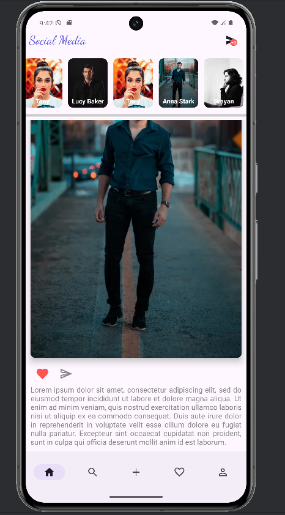
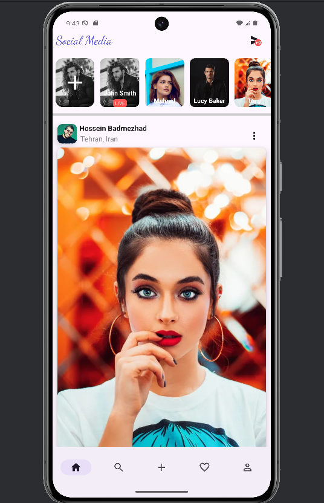

# 📱 Social Media (Jetpack Compose)

نمونه‌ی اپلیکیشن شبکه اجتماعی با **Jetpack Compose** برای تمرین طراحی UI و معماری مدرن اندروید.

<p align="center">
  
  
</p>

## ✨ ویژگی‌ها
- UI تمام‌Compose با **Material 3**
- لیست استوری‌ها (افقی) + فید پست‌ها
- کارت پست با تصویر، لایک، اشتراک‌گذاری، توضیح
- Bottom Navigation و چند تب
- پشتیبانی از Light/Dark Theme
- بارگذاری تصویر با **Coil**
- پیمایش با **Navigation-Compose**

## 🧱 تکنولوژی‌ها
- Kotlin, Jetpack Compose, Material3
- Navigation-Compose
- Coil (تصاویر)
- ViewModel, Kotlin Coroutines/Flow (قابل افزودن)
- Gradle Version Catalog (اختیاری)

## 📦 ساخت و اجرا
```bash
git clone https://github.com/hosseinmasoumi/SocialMedia.git
cd SocialMedia
# Android Studio Hedgehog/Koala+ را باز کنید و Run بگیرید
